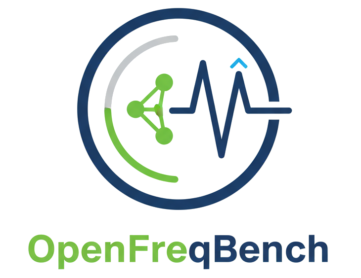

<!-- Logo / Title -->
<p align="center">
  
</p>

<h1 align="center">OpenFreqBench</h1>
<p align="center"><i>Open Benchmark of Power-System Frequency Estimators</i></p>

<!-- Badges (single row, no duplicates) -->
<p align="center">
  <a href="https://github.com/IngJorgeLuisMayorga/py-openfreqbench/actions/workflows/tests.yml">
    
  </a>
  
  <a href="LICENSE"></a>
  <a href="https://zenodo.org/doi/TBD"></a>
  
  <!-- Optional when you submit to JOSS:
  <a href="https://joss.theoj.org/papers/TBD"></a>
  -->
</p>

<!-- Quick Nav -->
<p align="center">
  <a href="#-overview">Overview</a> •
  <a href="docs/">Docs</a> •
  <a href="#-getting-started">Install</a> •
  <a href="#-quick-example">Run</a> •
  <a href="#-citation">Cite</a>
</p>

📖 [Developer Docs](docs/) • 🧠 [Research Wiki](https://github.com/IngJorgeLuisMayorga/py-openfreqbench/wiki)


---

## Overview  

**OpenFreqBench** is an open, reproducible platform for benchmarking **frequency and ROCOF estimators** in electric power systems.  
It provides a **common testbed** where classic, modern, and emerging algorithms are implemented and evaluated under **standardized, IEEE/IEC-aligned scenarios**.

> **Goal:** enable transparent, quantitative comparison of frequency-estimation methods for research, teaching, and industrial applications.


The project is designed for research, teaching, and industrial applications, and aligns with **IEEE/IEC standards** (e.g., IEC/IEEE 60255-118-1).  
All code, scenarios, and results are open and reproducible.  


## 🚀 Quick Actions
<p align="left">
  <a href="https://github.com/jlmayorgaco/py-power-systems-frequency-estimator-open-bench/issues?q=is%3Aissue+is%3Aopen+-label%3A%22epic%22+sort%3Acreated-asc">
    
  </a>
</p>

---

## Project Status

**Current Issue:** [ISSUE-15 · CI: cache Python dependencies for speed](../../issues/15)


---

## Key Features  

- **Comprehensive estimator library**  
  - Zero-Crossing, FFT, IpDFT, Recursive DFT  
  - LS, RLS, TLS, ML/NLLS  
  - Prony, Matrix Pencil, MUSIC, ESPRIT  
  - Taylor–Fourier, Dynamic Phasor methods  
  - PLL/FLL family (SRF, DDSRF, SOGI, EPLL, ANF)  
  - State-space filters (KF, EKF, UKF, CKF, PF, IMM)  
  - Time-frequency (Hilbert, STFT, Wavelets, SST)  
  - Hybrid and Machine Learning approaches  

- **Simulation scenarios**  
  - Synthetic signals: clean, noisy, harmonics, steps, ramps, chirps  
  - IEEE 13-bus and other feeders via OpenDSS (unbalance, taps, faults, harmonics)  
  - IEEE 39-bus and Kundur two-area systems (nadir, ROCOF, inter-area modes)  
  - Large-scale IEEE 8500-node with renewable/IBR penetration (low inertia, fast dynamics)  

- **Evaluation metrics**  
  - Frequency Error (FE), ROCOF Error (RFE)  
  - Dynamic response (rise time, settling, overshoot)  
  - Compliance envelopes aligned with **IEC/IEEE 60255-118-1**  
  - Computational cost and latency profiling  

- **Reproducibility**  
  - OpenDSS integration through `opendssdirect.py`  
  - Configurable scenarios (YAML specs)  
  - Results stored in structured formats (HDF5/Parquet)  
  - Full environment provided (Conda + Docker)  

---

## Repository Structure  

```
openfreqbench/                     # repo root (name whatever you like)
├─ pyproject.toml
├─ .ruff.toml
├─ Dockerfile
├─ Makefile
├─ README.md
├─ LICENSE
├─ reproduce.md
├─ .gitignore
├─ .dockerignore
│
├─ benchmarks/
│  └─ configs/
│     └─ baseline_freq.yaml
│
├─ results/                        # (gitignored artifacts)
│  └─ .keep
│
├─ tests/
│  ├─ conftest.py
│  ├─ test_runtime_smoke.py
│  └─ estimators/
│     └─ state_space/
│        └─ test_ekf_single_single.py
│
├─ docs/
│  ├─ SUITE.md
│  └─ artifacts/
│     ├─ estimators/
│     ├─ metrics/
│     ├─ reports/
│     ├─ scenarios/
│     └─ sources/
│
└─ ofb/                            # installable package (import as `ofb`)
   ├─ __init__.py
   ├─ version.py
   │
   ├─ cli/
   │  ├─ __init__.py
   │  ├─ ofb.py                   # Typer CLI (list, dry-run, plan, run-benchmark, calibrate, reports)
   │  ├─ scaffold.py              # `ofb new ...` / `ofb generate ...` (Angular-style)
   │  └─ docs.py                  # `ofb docs build|suite`
   │
   ├─ core/
   │  ├─ __init__.py
   │  ├─ registry.py              # register(), list_(), meta() with category support
   │  ├─ io.py                    # SingleIn, MultiIn, Distributed*In DTOs
   │  ├─ estimators_api.py        # Base classes + decorators (single/multi/distributed)
   │  ├─ dto.py                   # Frame, EstimatorResult, etc.
   │  ├─ policies.py              # EveryN, Cooldown (stubs ok)
   │  ├─ mapper.py                # quantile mapper (profile → N/B)
   │  ├─ memory_schema.py         # (optional) self.memory size estimator
   │  └─ errors.py
   │
   ├─ runtime/
   │  ├─ __init__.py
   │  ├─ realtime.py              # worker loop (stub ok)
   │  ├─ deterministic.py         # SimPy runner (stub ok)
   │  ├─ adapter.py               # payload → SingleIn/MultiIn/DistributedIn
   │  ├─ profiling.py             # MemoryMeter (RSS/pss/tracemalloc/torch cuda)
   │  ├─ timing.py                # monotonic, thread pinning helpers
   │  └─ logging_utils.py         # simple CSV logger wrapper
   │
   ├─ sources/
   │  ├─ __init__.py
   │  ├─ synthetic.py             # sine, step, ramp, harmonic generators
   │  ├─ opendss.py               # dss-python adapter (optional)
   │  └─ recorded.py              # CSV playback (optional)
   │
   ├─ sinks/
   │  ├─ __init__.py
   │  ├─ logger_csv.py            # per-run CSV writer
   │  └─ logger_parquet.py        # optional
   │
   ├─ scenarios/
   │  ├─ __init__.py
   │  ├─ base.py                  # Scenario protocol: build_source(), truth_f()
   │  ├─ catalog.yaml             # scenario metadata (tags, refs)
   │  ├─ ieee_60255/
   │  │  ├─ __init__.py
   │  │  ├─ freq_step_2s.py
   │  │  └─ freq_ramp_1hz_s.py
   │  ├─ pq_61000/
   │  │  ├─ __init__.py
   │  │  └─ harmonic_10pct_3rd.py
   │  └─ opendss_ieee13_fault.py  # quasi-static fault example
   │
   ├─ estimators/
   │  ├─ __init__.py
   │  └─ state_space/
   │     └─ ekf_single/
   │        ├─ __init__.py
   │        └─ single.py          # EKF example (researcher-facing)
   │
   ├─ metrics/
   │  ├─ __init__.py
   │  ├─ ieee_60255.py            # FE/RFE (and TVE if you add phasors)
   │  └─ stats.py                 # latency p50/p95, RMSE, etc.
   │
   ├─ reports/
   │  ├─ __init__.py
   │  ├─ standard.py              # tables + plots (boxplot, pareto)
   │  └─ creg_report.py           # example custom regulator report
   │
   ├─ benchmarks/
   │  ├─ __init__.py
   │  ├─ runner.py                # expands matrix, runs trials, saves tables
   │  ├─ tables.py                # merge metrics → summary_wide.csv
   │  └─ plots.py                 # helper plotting used by reports
   │
   ├─ config/
   │  ├─ __init__.py
   │  ├─ models.py                # Pydantic v2: BenchmarkCfg, RuntimeCfg, etc.
   │  └─ load.py                  # YAML loader/validator
   │
   └─ api.py                      # Python builder helpers (scenario/estimator/metric/report)

```

---

## Getting Started  

### Requirements  
- Python 3.10+  
- Recommended: Anaconda or Miniconda  

### Installation  

Clone the repository and install dependencies:  

```bash
git clone https://github.com/IngJorgeLuisMayorga/py-openfreqbench.git
cd py-openfreqbench
bash scripts/install.sh
conda activate openfreqbench
```

### Quick Example  

```python
# Add Estimator
from estimators.basic import ipdft
# Add Scenarios
from scenarios.s1_synthetic import make_clean
# Add Metrics 
from evaluation.metrics import frequency_error

# Generate synthetic test signal
signal, truth = make_clean(f0=60.0, df=0.2, duration=5.0, fs=5000)

# Run estimator
est = ipdft.IpDFT(fs=5000, frame_len=256)
f_hat = [est.update(chunk) for chunk in signal]

# Evaluate accuracy
print("RMSE:", frequency_error(f_hat, truth))
```


---
## 🧭 Roadmap

| Stage | Feature | Status |
|:------|:---------|:------:|
| Core architecture & packaging | `pyproject.toml`, CLI, base estimator | ✅ |
| Synthetic scenarios (steps, ramps, chirps) | Basic generators | ✅ |
| Evaluation metrics | FE, RFE, RMSE, latency | ✅ |
| IEC/IEEE compliance envelopes | M-class & P-class | 🧩 *in progress* |
| OpenDSS integration (13-bus, 39-bus) | Scenario adapters | 🧩 *in progress* |
| Advanced estimators (KF, PLL, ML) | Library extension | 🚧 *planned* |
| Continuous integration (CI) | GitHub Actions + tests | 🚧 *planned* |
| Paper & citation DOI | Zenodo + JOSS submission | 🚧 *planned* |

---

## 📁 Reproducibility & Results Layout

```
data/results/<timestamp>_<scenario>_<estimator>/
│
├── manifest.json        # run metadata (env, seeds, configs)
├── metrics.parquet      # per-sample FE/RFE
├── summary.json         # RMSE, rise/settle, compliance %
├── plots/               # Figures (FE/RFE vs time, envelopes)
└── logs/                # Pipeline logs
```

---

## Documentation  

Full documentation, examples, and API references are available in the [`docs/`](docs/) folder.  
Notebooks in [`notebooks/`](notebooks/) demonstrate usage with synthetic signals and IEEE test systems.  

---

## Citation  

If you use this project in academic work, please cite:  

```bibtex
@misc{openfreqbench2025,
  author       = {Mayorga, Jorge Luis},
  title        = {OpenFreqBench: Open Benchmark of Power-System Frequency Estimators},
  year         = {2025},
  url          = {https://github.com/IngJorgeLuisMayorga/py-openfreqbench}
}
```

---

## License  

This project is licensed under the **Apache License 2.0** – see the [LICENSE](LICENSE) file for details.  

---

## Acknowledgements  

- IEEE PES Task Force benchmark systems (13-bus, 39-bus, 8500-node)  
- OpenDSS and `opendssdirect.py` for feeder simulations  
- Research community contributions on frequency estimation methods  

---

## Contributing  

Contributions are welcome. Please open issues or pull requests for:  
- New estimator implementations  
- Additional benchmark scenarios  
- Improvements in metrics and compliance tests  
- Documentation and tutorials  
See CONTRIBUTING.md for guidelines and open issues.


---

<p align="center">
  
  
  
</p>

<p align="center">
  <sub>Crafted with ⚙️ precision and ❤️ passion by  
   © 2025 - <a href="https://github.com/IngJorgeLuisMayorga"><b>Jorge Luis Mayorga Taborda</b></a></sub>
</p>
